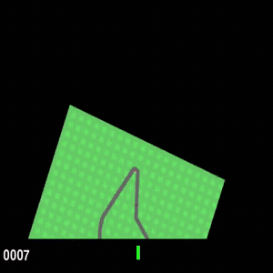

# Driving World Model

Deep Reinforcement Learning final project -- Empirical comparison between a model-free baseline (DQN/Rainbow) and a World Model (DreamerV3 / R2-Dreamer) on visual continuous control tasks with MuJoCo.

## Results

<table>
<tr>
<th>CarRacing-v3</th>
<th>Hopper-v5</th>
<th>Walker Walk</th>
</tr>
<tr>
<td><br/>Best reward: <strong>941</strong></td>
<td><br/>Best reward: <strong>21711</strong></td>
<td><br/>Best reward: <strong>927</strong></td>
</tr>
</table>

## Project context

In the first part of the course we implemented DQN and Rainbow DQN, which learn a Q-function directly from RGB observations by discretizing the action space. The goal of this second phase is to incorporate a **World Model**: a model that learns a latent representation of the environment and simulates future trajectories *in imagination*, allowing policy training without constant interaction with the real environment. This improves sample efficiency, especially when environment interaction is expensive.

## Base repository: R2-Dreamer

Based on [NM512/r2dreamer](https://github.com/NM512/r2dreamer), which includes:

- An **efficient DreamerV3 reproduction** in PyTorch (~5x faster than the older [dreamerv3-torch](https://github.com/NM512/dreamerv3-torch)).
- **R2-Dreamer** (ICLR 2026): a variant that removes the image reconstruction decoder and replaces it with a redundancy-reduction loss (Barlow Twins-style), achieving an additional ~1.6x speedup.
- Other baselines: InfoNCE, DreamerPro.

Algorithm selection via a single flag: `model.rep_loss=r2dreamer|dreamer|infonce|dreamerpro`.

## Repository structure

```
  driving-world-model/
  ├── pyproject.toml          # uv dependencies
  ├── train.py                # Hydra entry point
  ├── configs/
  │   └── config.yaml         # Unified config (env + model + training)
  ├── src/
  │   ├── __init__.py
  │   ├── agent.py            # Dreamer: world model + R2-Dreamer Barlow loss + actor-critic        
  │   ├── rssm.py             # RSSM: Block-GRU + observe/imagine/kl_loss
  │   ├── networks.py         # ConvEncoder, MLPHead, Projector, BlockLinear, ReturnEMA
  │   ├── distributions.py    # OneHotDist, TwoHot, BoundedNormal, symlog, kl
  │   ├── buffer.py           # Replay buffer (TorchRL SliceSampler)
  │   ├── envs.py             # DMC wrapper + ParallelEnv + make_envs
  │   └── tools.py            # Logger, weight_init, utilities
  └── r2dreamer/              # (original repo, untouched)
```

  To run:

  cd driving-world-model

  # Use Python 3.11 (dm-control/labmaze is not compatible with Python 3.14 on Windows)
  uv python install 3.11
  uv venv --python 3.11

  # Install dependencies
  uv sync

  # Quick debug run (few steps)
  uv run python train.py env.task=dmc_walker_walk training.steps=10000 env.env_num=2 env.eval_episode_num=2

  # Full training
  uv run python train.py env.task=dmc_walker_walk

## Original `r2dreamer/` repository structure

```
r2dreamer/
├── train.py              # Entry point (uses Hydra for configuration)
├── dreamer.py            # Dreamer class: world model + actor-critic
├── rssm.py               # RSSM: latent dynamics model (core of the world model)
├── networks.py           # Networks: CNN encoder, decoder, MLP heads, BlockLinear, Projector
├── distributions.py      # Distributions: OneHotDist, TwoHotSymlog, BoundedNormal, etc.
├── buffer.py             # Replay buffer based on TorchRL (SliceSampler by episodes)
├── trainer.py            # OnlineTrainer: training and evaluation loop
├── tools.py              # Utilities: logger, symlog, seeds, optimizer, etc.
├── optim/                # Custom optimizers
│   ├── agc.py            # Adaptive Gradient Clipping
│   └── laprop.py         # LaProp optimizer (replaces Adam)
├── configs/
│   ├── configs.yaml      # Hydra root config (defaults, buffer, trainer)
│   ├── env/
│   │   ├── dmc_vision.yaml   # DMC with 64x64 images (our case)
│   │   ├── dmc_proprio.yaml  # DMC with vector states
│   │   ├── atari100k.yaml    # Atari
│   │   ├── crafter.yaml      # Crafter
│   │   ├── metaworld.yaml    # MetaWorld (robotic manipulation)
│   │   └── memorymaze.yaml   # Memory Maze
│   └── model/
│       ├── _base_.yaml       # Base hyperparameters (RSSM, encoder, decoder, actor, critic, etc.)
│       ├── size12M.yaml      # 12M param model (sufficient for DMC, runs on consumer GPUs)
│       ├── size25M.yaml      # 25M param model
│       ├── size50M.yaml      # ...
│       ├── size100M.yaml
│       ├── size200M.yaml
│       └── size400M.yaml
├── envs/
│   ├── __init__.py       # Factory: make_envs() and make_env() by suite
│   ├── dmc.py            # DeepMind Control Suite wrapper (Gymnasium, 64x64 images)
│   ├── dmc_subtle.py     # DMC with small objects (extra benchmark)
│   ├── atari.py          # Atari wrapper
│   ├── crafter.py        # Crafter wrapper
│   ├── metaworld.py      # MetaWorld wrapper
│   ├── memorymaze.py     # Memory Maze wrapper
│   ├── parallel.py       # Parallel environment execution (multiprocessing)
│   └── wrappers.py       # Generic wrappers: TimeLimit, NormalizeActions, OneHotAction, Dtype
├── runs/                 # Launch scripts by benchmark
│   ├── dmc.sh            # Launches all DMC tasks with multiple seeds
│   ├── atari.sh
│   ├── crafter.sh
│   ├── metaworld.sh
│   └── memorymaze.sh
└── docs/
    ├── docker.md         # Docker instructions
    └── tensor_shapes.md  # Tensor shapes guide (very useful for understanding the code)
```

python train.py env=dmc_vision env.task=dmc_walker_walk model.compile=False trainer.steps=1e4     
  env.env_num=2 env.eval_episode_num=2 logdir=./logdir/debug

## How the pieces fit together

### 1. `train.py` -- Entry point

Uses Hydra to load the configuration (env + model), creates the buffer, parallel environments, instantiates the `Dreamer` agent and launches the `OnlineTrainer`. Saves weights to `latest.pt` upon completion.

### 2. `dreamer.py` -- The agent (World Model + Actor-Critic)

Contains all agent logic in a single `Dreamer(nn.Module)` class. Components:

- **World Model**:
  - `encoder`: CNN that maps 64x64 RGB images to latent embeddings.
  - `rssm`: the dynamics model (RSSM), which maintains a latent state = deterministic (GRU with BlockLinear) + stochastic (categoricals with unimix). Can perform `observe()` (with real observation) or `imagine()` (without observation, actions only).
  - `reward`: MLP head that predicts reward from the latent state (TwoHotSymlog distribution with 255 bins).
  - `cont`: MLP head that predicts episode continuation (binary distribution).
  - `decoder` (only in `dreamer` mode): transposed CNN that reconstructs the image. In R2-Dreamer this is removed and replaced with a `Projector` using Barlow Twins loss.

- **Actor-Critic** (trained in imagination):
  - `actor`: generates continuous actions (BoundedNormal distribution) from the imagined latent state.
  - `value`: estimates value with lambda-returns and TwoHotSymlog distribution.
  - `_slow_value`: critic target network (EMA update).
  - `ReturnEMA`: return normalization by percentiles (key DreamerV3 trick).

The `update()` method performs a full training step: samples from the buffer, observes with the RSSM, computes world model losses (KL + reward + cont + recon/barlow), imagines 15-step trajectories, and trains actor-critic on them.

### 3. `rssm.py` -- The latent dynamics model

The core of Dreamer. The latent state has two components:
- **Deterministic** (`deter`): maintained by a Block-GRU (GRU with BlockLinear for efficiency). Size 2048 in the 12M model.
- **Stochastic** (`stoch`): 32 categorical variables with 16 classes each, with unimix to prevent collapse.

Two modes of operation:
- `observe(embed, action, is_first)`: given the real encoder embedding, computes the *posterior* (what actually happened) and the *prior* (what the model predicted). The KL divergence between them is the training signal.
- `imagine(action, initial_state)`: generates latent trajectories using only the prior, without observations. This is what enables training the actor-critic "in imagination".

### 4. `networks.py` -- Neural networks

- `MultiEncoder`: CNN with `Conv2dSamePad` (5x5 kernels, increasing depth) for images + MLP for vector states.
- `MultiDecoder`: transposed CNN for image reconstruction (only in `dreamer` mode).
- `MLPHead`: generic network used for reward, cont, actor and critic. Each head has its own configurable output distribution.
- `BlockLinear`: block-wise linear layer (memory and compute efficiency in the RSSM GRU).
- `Projector`: used in R2-Dreamer for the Barlow Twins loss instead of the decoder.
- `ReturnEMA`: return normalization by 5%-95% percentiles.

### 5. `buffer.py` -- Replay Buffer

Based on `torchrl.ReplayBuffer` with `SliceSampler` that samples contiguous temporal sequences within episodes. Stores observations, actions and RSSM latent states (to reinitialize the RSSM without re-observing the entire sequence).

### 6. `trainer.py` -- Training loop

`OnlineTrainer.begin()` runs the main loop:
1. Steps environments on CPU (to avoid GPU<->CPU synchronizations).
2. Moves observations to GPU with `non_blocking=True`.
3. The agent acts (`agent.act()`), performing one RSSM + policy step.
4. Stores transitions in the buffer.
5. When enough data is available, calls `agent.update()` (trains world model + actor-critic).
6. Periodically evaluates and logs to TensorBoard.

## Key differences between DreamerV3 and R2-Dreamer

| | DreamerV3 (`dreamer`) | R2-Dreamer (`r2dreamer`) |
|---|---|---|
| Representation | Reconstructs images with CNN decoder | No decoder; uses Projector + Barlow Twins loss |
| Speed | Baseline (already ~5x faster than dreamerv3-torch) | ~1.6x faster than the baseline |
| Performance | State-of-the-art on DMC | Comparable or superior, without image reconstruction |
| VRAM | Higher (CNN decoder is expensive) | Lower |

## Running (DMC Vision)

```bash
cd r2dreamer

# Install dependencies
pip install -r requirements.txt

# Train DreamerV3 on walker_walk with images
python train.py env=dmc_vision env.task=dmc_walker_walk model.rep_loss=dreamer logdir=./logdir/dreamer_walker

# Train R2-Dreamer (no decoder) on walker_walk
python train.py env=dmc_vision env.task=dmc_walker_walk model.rep_loss=r2dreamer logdir=./logdir/r2dreamer_walker

# Monitor
tensorboard --logdir ./logdir
```

The default model is `size12M` (12M parameters), sufficient for DMC and runs on ~8GB VRAM.

## Main dependencies

- PyTorch 2.8, TorchRL 0.9.2
- MuJoCo 3.3, dm_control 1.0.28
- Gymnasium 1.2.1
- Hydra 1.3.2 (configuration)
- NumPy 1.26, OpenCV

## References

- [DreamerV3: Mastering Diverse Domains through World Models](https://arxiv.org/abs/2301.04104) (Hafner et al., 2023)
- [R2-Dreamer: Redundancy-Reduced World Models](https://openreview.net/forum?id=Je2QqXrcQq) (Morihira et al., ICLR 2026)
- [World Models](https://arxiv.org/abs/1803.10122) (Ha & Schmidhuber, 2018)
